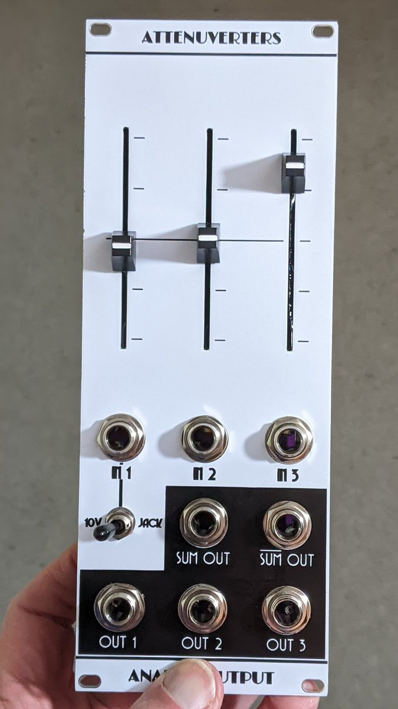
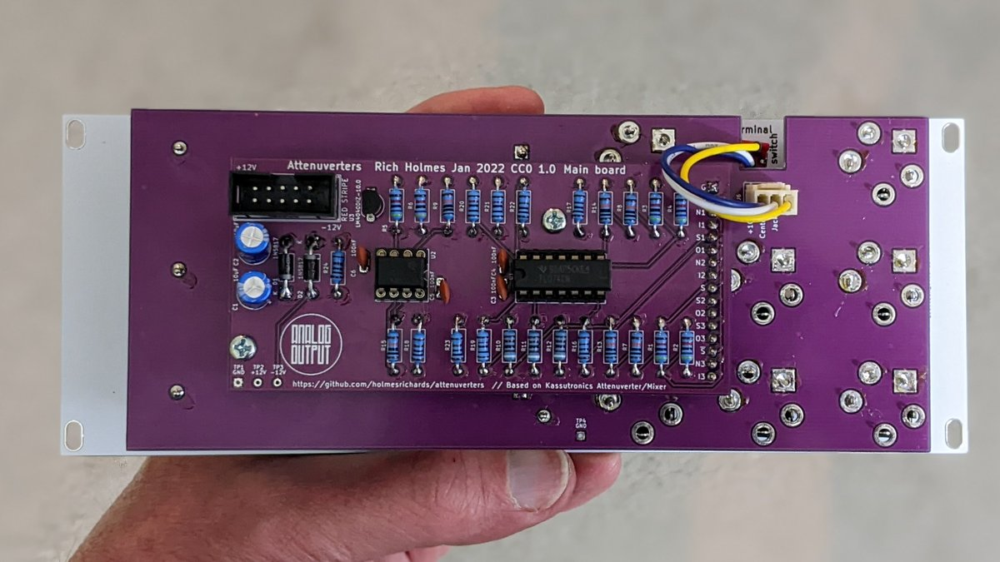

# Attenuverters

This is a utility synthesizer module in Kosmo format. It provides three attenuverters — that is, on each of the Out 1/2/3 outputs is whatever voltage went into In 1/2/3 with buffering and attenuation and, if the attenuator slider is below the midpoint, inverted as well. 

A toggle switch allows replacing In 1 with a 10 volt reference, allowing you to get any DC voltage from -10 V to +10 V on Out 1.

The sum of the three outputs appears on the Sum Out jack, and the inverted sum on the inverted Sum Out jack.

The attenuverters' response to the slider position is nonlinear: it is steeper on the ends than in the middle, making it easier to set small values precisely.

The design is inspired and informed by the Kassutronics Attenuverter/Mixer Eurorack module.

## Current draw
11 mA +12 V, 10 mA -12 V


## Photos





## Documentation

* [Schematic](Docs/attenuverters.pdf)
* PCB layout: [front](Docs/attenuverters_layout_front.pdf), [back](Docs/attenuverters_layout_back.pdf)
* [BOM](Docs/attenuverters_bom.md)
* [Build notes](Docs/attenuverters_build.md)

## GitHub repository

* [https://github.com/holmesrichards/attenuverters](https://github.com/holmesrichards/attenuverters)

## Submodules

This repo uses submodules aoKicad and Kosmo_panel, which provide needed libaries for KiCad. To clone:

```
git clone git@github.com:holmesrichards/attenuverters.git
git submodule init
git submodule update
```


Alternatively do

```
git clone --recurse-submodules git@github.com:holmesrichards/attenuverters.git
```

Or if you download the repository as a zip file, you must also click on the "aoKicad" and "Kosmo\_panel" links on the GitHub page (they'll have "@ something" after them) and download them as separate zip files which you can unzip into this repo's aoKicad and Kosmo\_panel directories.

If desired, copy the files from aoKicad and Kosmo\_panel to wherever you prefer (your KiCad user library directory, for instance, if you have one). Then in KiCad, go into Edit Symbols and add symbol libraries 

```
aoKicad/ao_symbols
Kosmo_panel/Kosmo
```
and go into Edit Footprints and add footprint libraries 
```
aoKicad/ao_tht
Kosmo_panel/Kosmo_panel.
```
